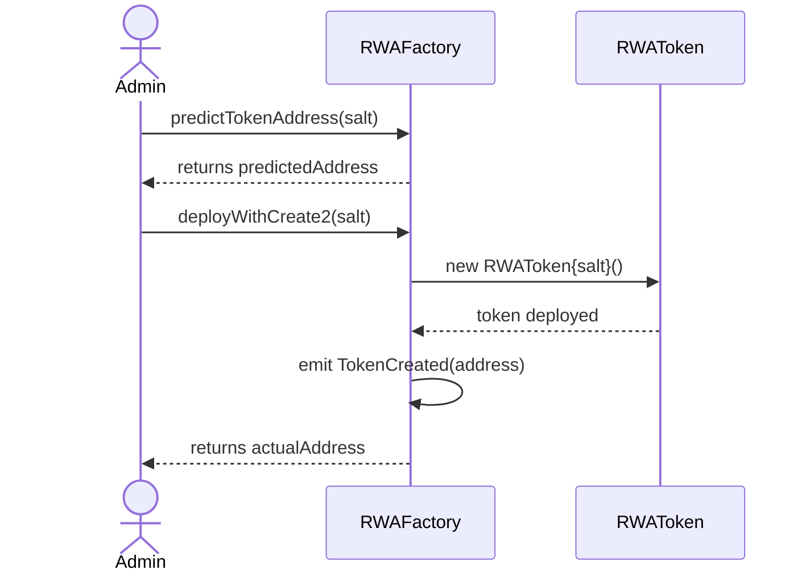
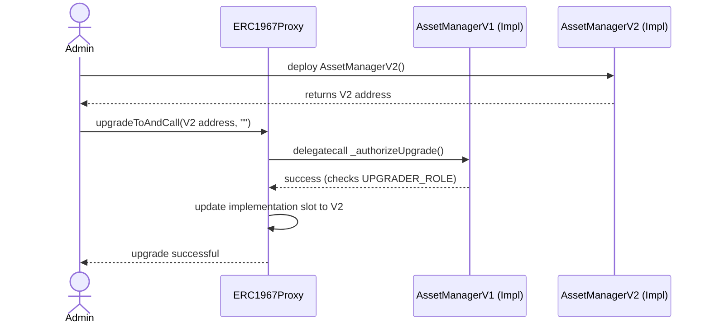

# Architecture & Design Document

**Project:** RWA Tokenization Platform (Option C)
**Team:** [Yerulan, Yerassyl, Zharkynai]
**Author (Lead Smart Contract & Architecture):** Yerulan

## 1. System Context & Container Diagram (C4 Level 1 & 2)

This section outlines the high-level architecture of our RWA protocol and the interactions between core contracts, external dependencies, and actors.

## 2. Sequence Diagrams

Below are the sequence diagrams illustrating the critical user flows within the protocol.

### 2.1 RWA Token Deployment via CREATE2

The `RWAFactory` utilizes the `CREATE2` opcode to ensure deterministic deployment of asset tokens, allowing off-chain clients to predict the address before spending gas.

### 2.2 Secure Logic Upgrade (UUPS V1 to V2)

The protocol uses the UUPS (Universal Upgradeable Proxy Standard). The upgrade logic is secured by the `UPGRADER_ROLE`.

(Note: The third sequence diagram for AMM Swaps / DAO Voting will be added by Team Member 2/3).

## 3. Data Model & Storage Layout

To ensure safe upgradeability, we strictly monitor the storage layout. Below is the proof from Foundry (`forge inspect`) demonstrating that upgrading from `AssetManagerV1` to `AssetManagerV2` does not cause storage collisions.

| Name        | Type    | Slot | Offset | Bytes | Contract                             |
|=============|=========|======|========|=======|======================================|
| rwaToken    | address | 0    | 0      | 20    | src/AssetManagerV2.sol:AssetManagerV2|
| kycPassport | address | 1    | 0      | 20    | src/AssetManagerV2.sol:AssetManagerV2|
| platformFee | uint256 | 2    | 0      | 32    | src/AssetManagerV2.sol:AssetManagerV2|

_Conclusion: `platformFee` is safely appended to Slot 2, preserving Slots 0 and 1._

## 4. Trust Assumptions & Access Control

The protocol operates under the following trust assumptions and role distributions:

- **DEFAULT_ADMIN_ROLE:** The highest privilege. Initially held by the deployer, ultimately transferred to the DAO Timelock. Can grant or revoke any role.
    
- **UPGRADER_ROLE:** Authorized to call `upgradeToAndCall` on the UUPS proxy. If compromised, a malicious implementation could drain the protocol.
    
- **PAUSER_ROLE:** An emergency role (Circuit Breaker) capable of halting token transfers via `pause()`.
    
- **KYC_ISSUER_ROLE:** Authorized to mint and revoke Soulbound KYC Passports.
    
- **Centralization Risks:** Before the DAO transition, the protocol relies on a multisig/admin not acting maliciously. Post-transition, trust is shifted to the token holders.

## 5. Architecture Decision Records (ADRs)

#### ADR 1: Choice of Proxy Pattern

- **Context:** We needed an upgradeable architecture for the Asset Manager.
    
- **Options:** Transparent Proxy vs. UUPS (ERC1967).
    
- **Decision:** UUPS was chosen.
    
- **Consequences:** Cheaper deployment costs. However, it requires extreme caution: if an implementation is deployed without `_authorizeUpgrade`, the proxy becomes permanently "bricked".
    

#### ADR 2: Factory Deployment Method

- **Context:** Deploying new RWA tokens efficiently.
    
- **Options:** Standard `CREATE` vs. `CREATE2`.
    
- **Decision:** We implemented both, but prioritize `CREATE2` for production.
    
- **Consequences:** Allows the frontend to accurately predict the token contract address before deployment, improving UX.
    

#### ADR 3: KYC Implementation

- **Context:** Complying with real-world asset regulations (Role-gated minting).
    
- **Options:** Whitelist mapping in ERC20 vs. Separate ERC721 NFT.
    
- **Decision:** We chose a Soulbound ERC721 (Non-transferable NFT).
    
- **Consequences:** Makes the KYC status composable (other DApps can check the NFT balance) and keeps the ERC20 token logic cleaner.