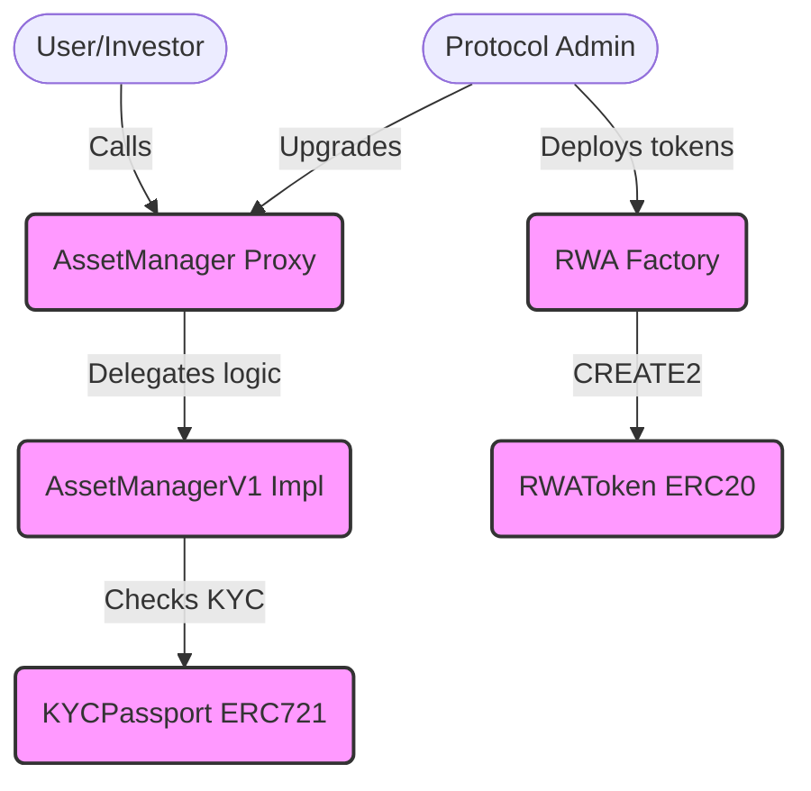
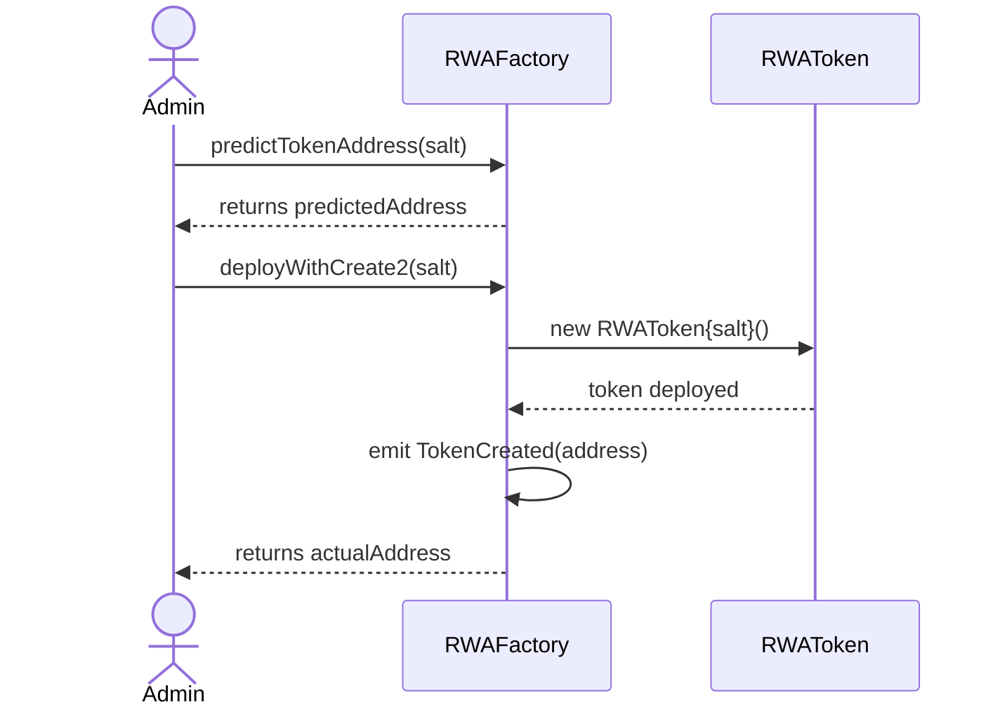
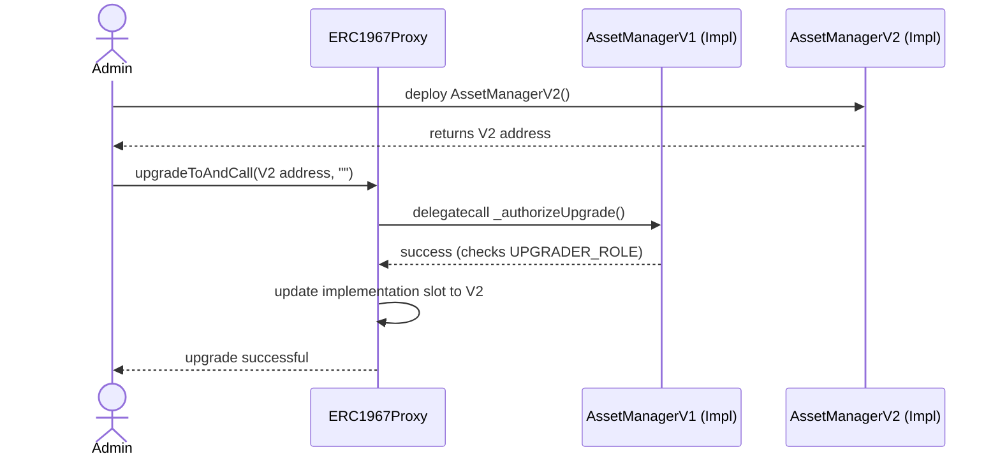
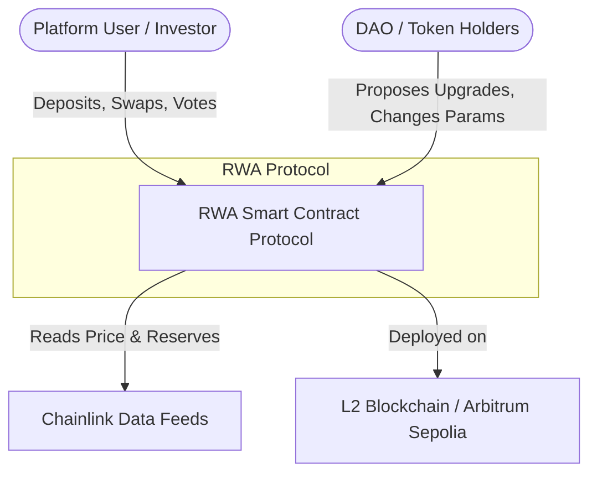
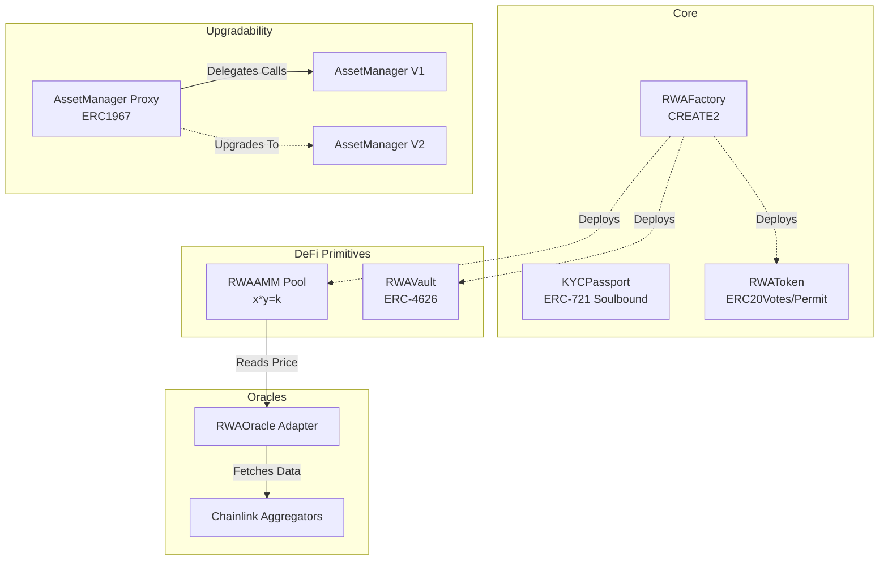
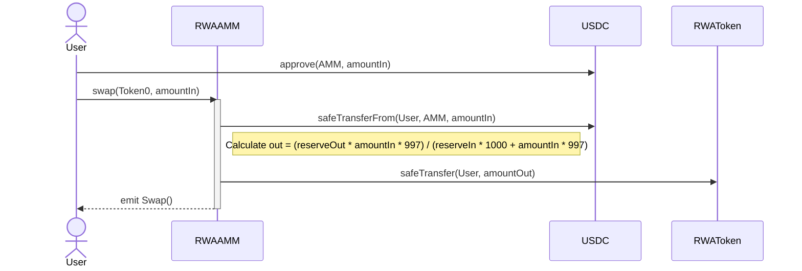
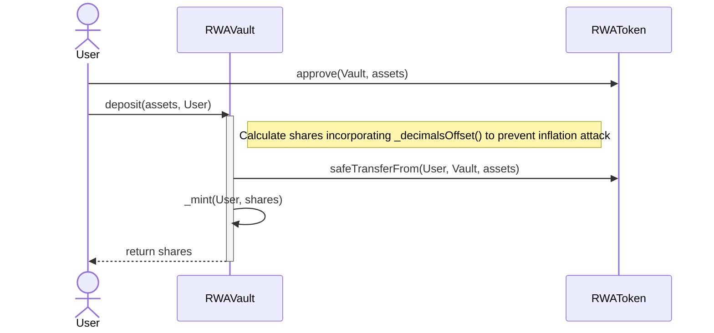
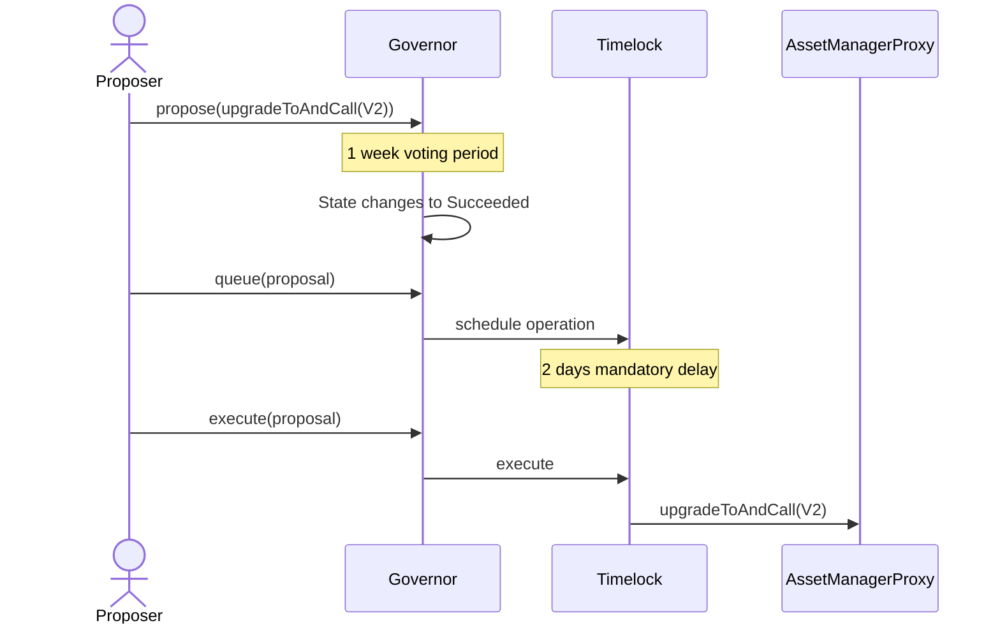

# Architecture & Design Document

**Project:** RWA Tokenization Platform (Option C)
**Team:** [Yerulan, Yerassyl, Zharkynai]
**Author (Lead Smart Contract & Architecture):** Yerulan

## 1. System Context & Container Diagram (C4 Level 1 & 2)

This section outlines the high-level architecture of our RWA protocol and the interactions between core contracts, external dependencies, and actors.

## 2. Sequence Diagrams

Below are the sequence diagrams illustrating the critical user flows within the protocol.

### 2.1 RWA Token Deployment via CREATE2

The `RWAFactory` utilizes the `CREATE2` opcode to ensure deterministic deployment of asset tokens, allowing off-chain clients to predict the address before spending gas.

### 2.2 Secure Logic Upgrade (UUPS V1 to V2)

The protocol uses the UUPS (Universal Upgradeable Proxy Standard). The upgrade logic is secured by the `UPGRADER_ROLE`.

(Note: The third sequence diagram for AMM Swaps / DAO Voting will be added by Team Member 2/3).

## 3. Data Model & Storage Layout

To ensure safe upgradeability, we strictly monitor the storage layout. Below is the proof from Foundry (`forge inspect`) demonstrating that upgrading from `AssetManagerV1` to `AssetManagerV2` does not cause storage collisions.

| Name        | Type    | Slot | Offset | Bytes | Contract                             |
|=============|=========|======|========|=======|======================================|
| rwaToken    | address | 0    | 0      | 20    | src/AssetManagerV2.sol:AssetManagerV2|
| kycPassport | address | 1    | 0      | 20    | src/AssetManagerV2.sol:AssetManagerV2|
| platformFee | uint256 | 2    | 0      | 32    | src/AssetManagerV2.sol:AssetManagerV2|

_Conclusion: `platformFee` is safely appended to Slot 2, preserving Slots 0 and 1._

## 4. Trust Assumptions & Access Control

The protocol operates under the following trust assumptions and role distributions:

- **DEFAULT_ADMIN_ROLE:** The highest privilege. Initially held by the deployer, ultimately transferred to the DAO Timelock. Can grant or revoke any role.
    
- **UPGRADER_ROLE:** Authorized to call `upgradeToAndCall` on the UUPS proxy. If compromised, a malicious implementation could drain the protocol.
    
- **PAUSER_ROLE:** An emergency role (Circuit Breaker) capable of halting token transfers via `pause()`.
    
- **KYC_ISSUER_ROLE:** Authorized to mint and revoke Soulbound KYC Passports.
    
- **Centralization Risks:** Before the DAO transition, the protocol relies on a multisig/admin not acting maliciously. Post-transition, trust is shifted to the token holders.

## 5. Architecture Decision Records (ADRs)

#### ADR 1: Choice of Proxy Pattern

- **Context:** We needed an upgradeable architecture for the Asset Manager.
    
- **Options:** Transparent Proxy vs. UUPS (ERC1967).
    
- **Decision:** UUPS was chosen.
    
- **Consequences:** Cheaper deployment costs. However, it requires extreme caution: if an implementation is deployed without `_authorizeUpgrade`, the proxy becomes permanently "bricked".
    

#### ADR 2: Factory Deployment Method

- **Context:** Deploying new RWA tokens efficiently.
    
- **Options:** Standard `CREATE` vs. `CREATE2`.
    
- **Decision:** We implemented both, but prioritize `CREATE2` for production.
    
- **Consequences:** Allows the frontend to accurately predict the token contract address before deployment, improving UX.
    

#### ADR 3: KYC Implementation

- **Context:** Complying with real-world asset regulations (Role-gated minting).
    
- **Options:** Whitelist mapping in ERC20 vs. Separate ERC721 NFT.
    
- **Decision:** We chose a Soulbound ERC721 (Non-transferable NFT).
    
- **Consequences:** Makes the KYC status composable (other DApps can check the NFT balance) and keeps the ERC20 token logic cleaner.

# 🏗️ Architecture Document: RWA Tokenization Platform

## 1. Executive Summary
This document outlines the architectural design, component interactions, storage layouts, and design decisions for the RWA Tokenization Platform. The system is designed to securely tokenize Real World Assets (RWA), provide liquidity via an automated market maker (AMM), and offer yield generation through an ERC-4626 Vault, all governed by a decentralized DAO.

---

## 2. System Context (C4 Level 1)
The Context diagram illustrates the high-level interactions between the users, our platform, and external systems (Chainlink Oracles).

## 3. Container & Component Diagram (C4 Level 2)
This diagram details the internal smart contract architecture, showing how the Factory deploys components, how the UUPS Proxy routes logic, and how the DeFi primitives interact.

## 4. Sequence Diagrams (Critical User Flows)
Below are the sequence diagrams for the three most critical protocol operations.

### Flow 1: Token Swap in AMM (x * y = k)

### Flow 2: Yield Vault Deposit (ERC-4626)

### Flow 3: DAO Upgrade Flow (UUPS Proxy)

## 5. Storage Layout & Data Model
Managing storage correctly is critical for the `AssetManager` UUPS Proxy to prevent storage collisions during V1 -> V2 upgrades.

|**Slot**|**Type**|**Variable Name**|**Description**|
|---|---|---|---|
|`0`|`address`|`owner`|Admin address (Inherited from OwnableUpgradeable)|
|`1`|`uint256`|`totalAssetsManaged`|Tracks total RWA volume|
|`2`|`mapping`|`whitelistedIssuers`|KYC'd asset issuers|

**AssetManagerV2 Storage (Upgrade Path):**

|**Slot**|**Type**|**Variable Name**|**Description**|
|---|---|---|---|
|`0`|`address`|`owner`|Must remain at Slot 0|
|`1`|`uint256`|`totalAssetsManaged`|Must remain at Slot 1|
|`2`|`mapping`|`whitelistedIssuers`|Must remain at Slot 2|
|`3`|`uint256`|`platformFee`|**NEW IN V2:** Appended to avoid collisions|
_Safety Check:_ No variables were deleted or reordered. New state variables are strictly appended to the end of the layout.

## 6. Trust Assumptions & Role Management
The protocol relies on several trust assumptions and strictly defined roles to minimize centralization vectors.

- **Upgrades (`UPGRADER_ROLE`):** Held exclusively by the `TimelockController`. No single EOA (Externally Owned Account) can upgrade the proxy.
    
- **Minting (`MINTER_ROLE`):** Held by the Factory and the DAO. Users can only mint if they have passed the KYC process and hold the `KYCPassport` NFT.
    
- **Oracle Integrity:** We assume Chainlink node operators behave honestly. However, we mitigate stale data by hardcoding a `1 hours` timeout.
    
- **Multisig Compromise:** If the DAO governance is bypassed, the 2-day Timelock delay provides a "circuit breaker" window for users to withdraw their liquidity (`removeLiquidity`) and exit the Vault before a malicious upgrade executes.

## 7. Architecture Decision Records (ADRs)
### ADR-01: Upgradability Pattern

- **Context:** The core `AssetManager` requires future updates.
    
- **Decision:** Implement **UUPS (Universal Upgradeable Proxy Standard)** instead of Transparent Proxy.
    
- **Consequences:** Gas costs for deployment and user interactions are cheaper. The upgrade logic resides in the implementation, requiring careful attention to avoid bricking the contract (ensured by OpenZeppelin's `_authorizeUpgrade`).
    

### ADR-02: Inflation Attack Mitigation in Yield Vault

- **Context:** ERC-4626 Vaults are susceptible to the "first depositor" (donation) attack, where an attacker manipulates the share price by sending raw assets to the contract.
    
- **Decision:** Override `_decimalsOffset()` to return `3`.
    
- **Consequences:** The vault creates 10^3 virtual assets and shares. It mathematically forces attackers to spend an exponentially larger, economically unviable amount of capital to execute the donation attack.
    

### ADR-03: AMM Math Optimization

- **Context:** Calculating the initial liquidity shares requires a square root function `sqrt(x * y)`. Pure Solidity implementations are gas-intensive.
    
- **Decision:** Implement the Babylonian square root method using **Inline Yul Assembly**.
    
- **Consequences:** Readability is slightly reduced, but gas consumption during pool initialization is drastically optimized.

